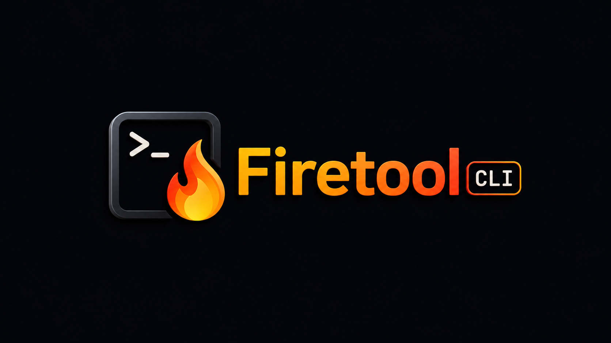

# Firetool CLI

[](https://www.typescriptlang.org/)
[](https://bun.sh/)
[](https://firebase.google.com/docs/emulator-suite)
[](#local-only-by-design)
[](LICENSE)



**Firetool CLI is an agent-first command line tool for controlling Firebase emulators without ever falling back to real Firebase resources.**

Firebase emulators are excellent for local development, but they are awkward to inspect, seed, reset, and automate across Auth, Firestore, Realtime Database, Storage, Functions, Pub/Sub, and Rules. That friction gets worse when AI agents, scripts, or CI jobs need predictable structured output and safe failure modes.

Firetool solves that by giving developers and automation a single local-only CLI with consistent JSON output, explicit exit codes, dry-run support, and guardrails around destructive operations.

## Why this exists

Modern development workflows increasingly rely on agents, repeatable test data, and local integration environments. Firebase projects often end up needing one-off scripts for common emulator tasks:

- creating and deleting Auth emulator users;
- seeding Firestore or Realtime Database data;
- exporting local state for debugging;
- clearing emulator data between tests;
- calling local Functions;
- publishing local Pub/Sub messages;
- checking Firestore and Storage rules behavior;
- detecting whether the right emulator context is running.

Firetool turns those tasks into a stable CLI surface designed for both humans and machines.

## Highlights

- **Local-only safety model**: Firetool blocks non-local hosts and is designed to operate only against Firebase emulators.
- **Agent-friendly output**: every command can emit structured JSON with `--json`.
- **Predictable failures**: error categories map to distinct exit codes for shell scripts and AI agents.
- **Destructive-operation guardrails**: dangerous operations require `--force`; many support `--dry-run`.
- **Firebase context discovery**: `firetool doctor` inspects `firebase.json`, `.firebaserc`, emulator environment variables, and running ports.
- **Multi-service coverage**: Auth, Firestore, Realtime Database, Storage, Functions, Pub/Sub, and security rules.
- **Typed internals**: built with TypeScript, Zod schemas, and a tRPC-style internal router.

## Service coverage

| Service | What Firetool helps with | Common methods |
| --- | --- | --- |
| Auth Emulator | Create, inspect, update, and clean up local users for tests and demos. | `create-user`, `list-users`, `get-user`, `update-user`, `delete-user`, `clear-users` |
| Firestore Emulator | Work with local documents and collections, including repeatable seed/import/export flows. | `get`, `list`, `set`, `update`, `query`, `seed`, `import`, `export`, `delete`, `delete-collection`, `clear` |
| Realtime Database Emulator | Read, write, query, seed, export, and reset local RTDB paths. | `get`, `set`, `update`, `push`, `query`, `seed`, `import`, `export`, `delete`, `clear` |
| Storage Emulator | Manage local bucket objects without touching production storage. | `list`, `upload`, `download`, `remove`, `clear` |
| Functions Emulator | Invoke local Firebase Functions by name or URL with JSON payloads. | `call` |
| Pub/Sub Emulator | Publish structured local messages with optional attributes. | `publish` |
| Rules checks | Probe Firestore and Storage security rules locally for a path, intent, and auth context. | `check` |
| Diagnostics | Discover Firebase project context and emulator availability before acting. | `doctor`, `help-info` |

## Agent skill

This repository includes a concise skill for AI agents at [`skill/firetool-cli/skill.md`](skill/firetool-cli/skill.md). It tells agents how to discover and use the CLI through `firetool --help`, `firetool help-info`, and JSON-first command execution instead of relying on copied command lists.

## Installation

Install Firetool globally:

```bash
npm install -g firetool-cli
```

Then run it inside a Firebase project using the Emulator Suite:

```bash
firetool doctor
firetool doctor --json
```

## Local development

This repository uses Bun.

```bash
bun install
bun run check
bun run build
```

Run the CLI directly from source:

```bash
bun run dev -- doctor --json
```

Build output is generated under `dist/` and is intentionally ignored by Git.

## Quick start

Start Firebase emulators in your project:

```bash
firebase emulators:start
```

Diagnose the local context:

```bash
firetool doctor --json
```

Create a local Auth user:

```bash
firetool auth create-user \
  --email user@example.test \
  --password secret123 \
  --json
```

Seed a Firestore collection:

```bash
firetool firestore seed products \
  --file ./products.seed.json \
  --dry-run \
  --json
```

Call a local Firebase Function:

```bash
firetool functions call createUserProfile \
  --data '{"uid":"abc123"}' \
  --json
```

Publish a local Pub/Sub message:

```bash
firetool pubsub publish user-created \
  --data '{"uid":"abc123"}' \
  --attribute source=local-test \
  --json
```

Check local security rules:

```bash
firetool rules check \
  --service firestore \
  --path products/abc123 \
  --intent read \
  --auth-uid user_123 \
  --json
```

## Commands

| Area | Command | What to use it for | Useful flags |
| --- | --- | --- | --- |
| Diagnostics | `firetool doctor` | Check whether Firetool found a Firebase project and which emulators are configured/running. | `--json` |
| Discovery | `firetool help-info [service]` | Print the agent-first usage guide, service catalog, and error model. | `--json` |
| Auth | `firetool auth <method>` | Manage local Auth emulator users for tests, demos, and repeatable local setup. | `--json`, `--force` |
| Firestore | `firetool firestore <method>` | Inspect, mutate, seed, import/export, and clear local Firestore data. | `--json`, `--dry-run`, `--force`, `--file`, `--data` |
| Realtime Database | `firetool rtdb <method>` | Inspect, mutate, seed, import/export, and clear local RTDB paths. | `--json`, `--dry-run`, `--force`, `--file`, `--data` |
| Storage | `firetool storage <method>` | List, upload, download, remove, and clear local Storage emulator objects. | `--json`, `--dry-run`, `--force`, `--bucket`, `--file` |
| Functions | `firetool functions call <name-or-url>` | Invoke a local Firebase Function with an optional JSON payload. | `--json`, `--data` |
| Pub/Sub | `firetool pubsub publish <topic>` | Publish local Pub/Sub messages with optional attributes. | `--json`, `--data`, `--attribute` |
| Rules | `firetool rules check` | Check Firestore or Storage rules locally for a path, operation intent, and optional auth context. | `--json`, `--service`, `--path`, `--intent`, `--auth-uid` |

## Local-only by design

Firetool is intentionally scoped to local Firebase emulator workflows. It discovers emulator settings from:

- `firebase.json`;
- `.firebaserc`;
- Firebase emulator environment variables such as `FIRESTORE_EMULATOR_HOST`;
- default local emulator ports.

Before sensitive operations, it checks that the target service is configured, running, local, and unambiguous. Non-local hosts are blocked instead of being treated as valid targets.

Accepted by default: `localhost`, the full `127.0.0.0/8` loopback range, `0.0.0.0` (commonly used by Firebase emulators and WSL setups), IPv6 loopback (`::1`, expanded forms, `::ffff:127.x.x.x`), and custom hostnames whose DNS resolves exclusively to loopback addresses.

For Docker, devcontainer, and WSL topologies where the emulator is reachable via a non-loopback hostname (e.g. `host.docker.internal`), add that hostname to the explicit allowlist:

```bash
export FIRETOOL_ALLOWED_EMULATOR_HOSTS=host.docker.internal,firebase-emulator
```

Private LAN IPs (`192.168.x.x`, `10.x.x.x`, `172.16–31.x.x`) are blocked by default because they may represent another machine, a shared environment, or a container Firetool should not target without an explicit decision. Add a specific IP to the allowlist if you genuinely run emulators there.

See [docs/host-strategy.md](docs/host-strategy.md) for the full explanation of the classification model, all supported topology scenarios, and the Firestore admin vs rules-check distinction.

## JSON output and exit codes

Use `--json` when integrating with agents, scripts, or CI:

```json
{
  "ok": true,
  "operation": "firestore.seed",
  "target": {
    "service": "firestore",
    "resourcePath": "products"
  },
  "result": {},
  "warnings": []
}
```

Known error categories use distinct exit codes:

| Error code | Meaning |
| --- | --- |
| `CONTEXT_NOT_FOUND` | No Firebase project context was found. |
| `SERVICE_NOT_CONFIGURED` | The requested emulator is not configured. |
| `EMULATOR_NOT_RUNNING` | The emulator is configured but unavailable locally. |
| `INVALID_INPUT` | JSON, flags, paths, or identifiers are invalid. |
| `CONFIRMATION_REQUIRED` | A destructive operation needs confirmation or `--force`. |
| `RULE_DENIED` | Local rules denied the requested operation. |
| `AMBIGUOUS_TARGET` | Firetool cannot determine the local target safely. |

## License

MIT
